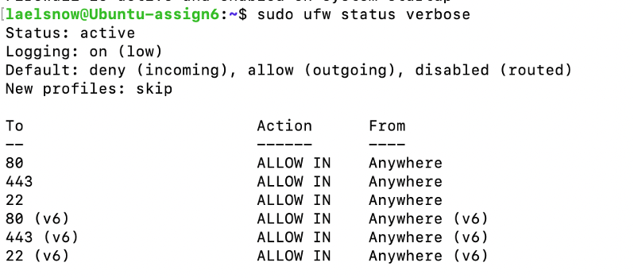
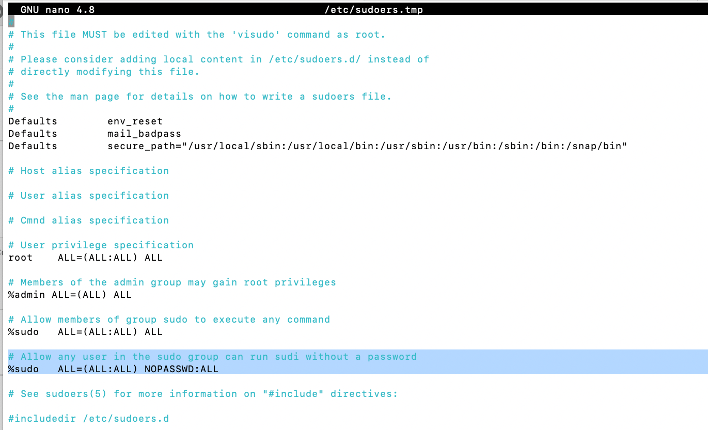
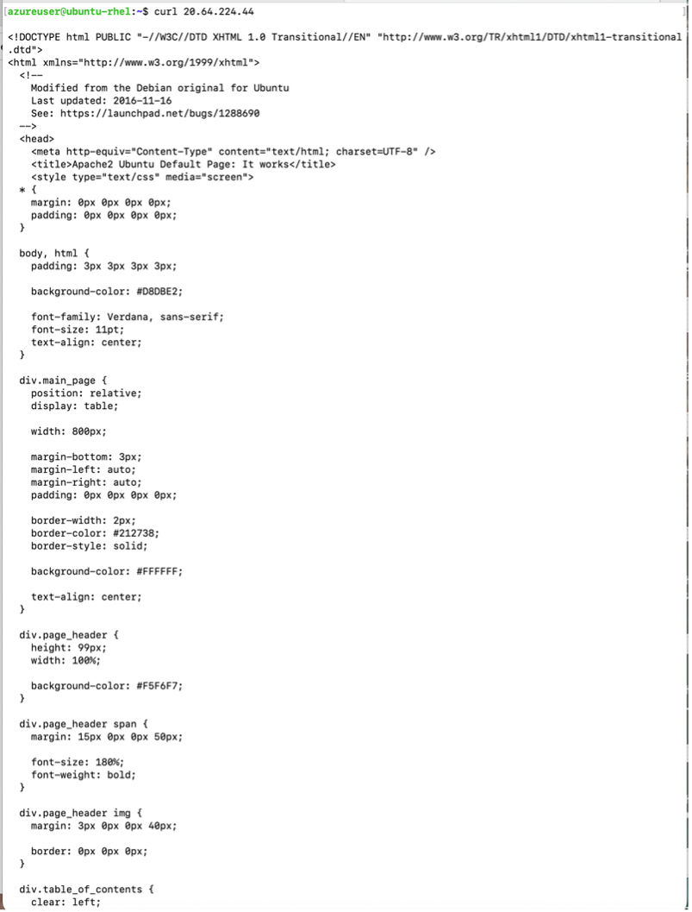

# Secure Linux Firewalls: Ubuntu 20.04 Hardening + Apache + Nginx

## Overview
In this project, I created and configured two Ubuntu 20.04 virtual machines and practiced real system administration tasks such as user setup, sudo configuration, installing services, verifying connectivity, and securing the systems using firewall rules.

The main focus of this project was learning how to manage Linux systems in a cloud environment while reducing attack surface using UFW and validating services using tools like `systemctl` and `curl`.

---

## Tools / Tech Used
- Microsoft Azure Virtual Machines
- Ubuntu 20.04 (2 VMs)
- UFW (Uncomplicated Firewall)
- Apache2
- Nginx
- systemctl
- curl
- ping
- sudo / visudo
- Linux log files

---

## What I Did
### 1. Provisioned two Ubuntu 20.04 VMs
- Created two Ubuntu 20.04 instances in Azure
- Verified basic connectivity between systems using ping

### 2. Created users and configured sudo
- Created multiple local users
- Created an `instructor` user
- Configured sudo permissions using `visudo`
- Verified sudo access worked correctly

### 3. Installed and verified web services
- Installed Apache2 and started the service using `systemctl`
- Installed Nginx and started the service using `systemctl`
- Verified both services using `curl 127.0.0.1`

### 4. Configured UFW firewall rules
- Enabled UFW with a default deny policy
- Allowed required traffic (ex: SSH)
- Verified firewall rules using `ufw status`
- Located and reviewed firewall and service logs

---

## Screenshots (Proof)

### VM-to-VM Connectivity (Ping Test)
This screenshot shows successful connectivity between the two Ubuntu virtual machines in Azure.

### UFW Firewall Rules (Default Deny + Allowed Ports)
This screenshot shows UFW enabled with a default deny policy and only required ports allowed.

### Passwordless Sudo Configuration (visudo)
This screenshot shows the sudoers configuration that allows the sudo group to run commands without entering a password.

### Apache Web Server Verification (curl)
This screenshot shows Apache running and responding successfully when accessed remotely using curl.

### Nginx Web Server Verification (curl)
This screenshot shows Nginx running and responding successfully when accessed remotely using curl.

---

## What I Learned
- How to manage Linux users and privileges securely
- How to start/stop services and verify they are running
- How to reduce attack surface using a default-deny firewall policy
- How to validate services locally and across systems using `curl` and `ping`
- Why logs are important for security monitoring and troubleshooting

---

## Security Relevance (Why this matters)
This project demonstrates foundational blue-team and system administration skills: account management, least privilege, firewall enforcement, service validation, and log awareness. These are core tasks in real Linux server environments.

---

## Next Improvements
- Harden SSH (disable password login, require SSH keys)
- Add monitoring and alerting (ex: forward logs into Splunk)
- Expand firewall rules to support a DMZ-style layout

