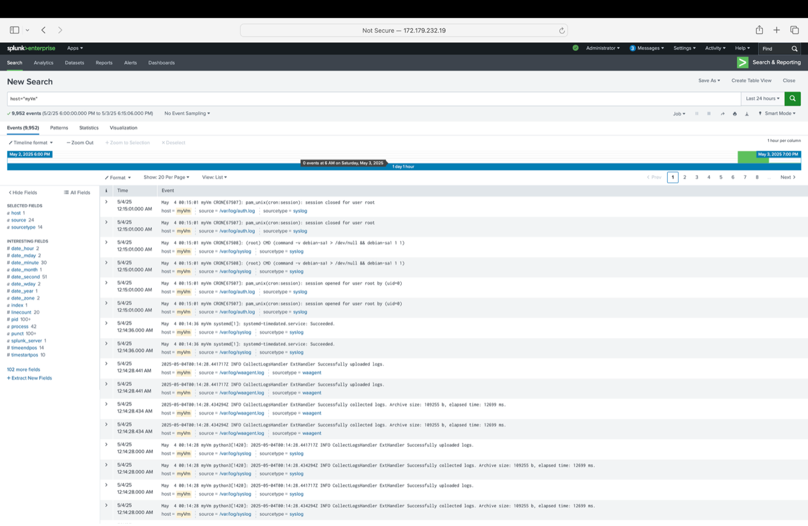

# Splunk Monitoring: Enterprise + Universal Forwarder (Ubuntu)

## Overview
In this project, I installed and configured Splunk Enterprise on one Ubuntu virtual machine and installed the Splunk Universal Forwarder on a second Ubuntu virtual machine. The goal was to forward and centralize system logs so they could be searched and analyzed through Splunk’s web interface.
This project demonstrates foundational SIEM-style monitoring skills including log ingestion, remote forwarding, and validating data collection through Splunk Search & Reporting.

---

## Tools Used
- Ubuntu (2 Virtual Machines)
- Splunk Enterprise
- Splunk Universal Forwarder
- UFW firewall rules
- Linux log files (`/var/log`)
- Splunk Web UI (Search & Reporting)

---

## What I Did
### 1. Installed Splunk Enterprise on VM #1
- Installed Splunk Enterprise using a `.deb` package
- Enabled Splunk to start automatically at boot
- Started Splunk and confirmed the service was running
- Opened required ports in UFW (8000 and 9997)

### 2. Enabled log ingestion on the Splunk server
- Added `/var/log` as a data input
- Configured Splunk to receive forwarded logs on port `9997`

### 3. Installed Universal Forwarder on VM #2
- Installed Splunk Universal Forwarder using a `.deb` package
- Enabled the forwarder to start automatically at boot
- Connected the forwarder to the Splunk server on port `9997`
- Added `/var/log` as a monitored directory

### 4. Verified logs were successfully forwarded
- Used Splunk Search & Reporting to confirm logs from the second VM were being indexed and searchable

---
## Screenshots (Proof)

### Splunk Search & Reporting (Forwarded Logs)
This screenshot shows Splunk Enterprise successfully indexing and displaying log events through the Search & Reporting interface after configuring log collection and forwarding.

---

## What I Learned
- How Splunk Enterprise ingests and indexes logs from a Linux host
- How Universal Forwarder securely forwards logs from a remote machine
- Why centralized logging is important for monitoring and security auditing
- How to validate log ingestion using Splunk Search & Reporting

---

Splunk is widely used for monitoring, auditing, and incident response. This project demonstrates core SIEM skills such as log collection, remote forwarding, and searching across multiple systems for visibility and detection.

---

## Next Improvements
- Add alerts for suspicious authentication activity
- Forward logs into specific indexes (auth, system, web)
- Create dashboards for failed login attempts and firewall events

